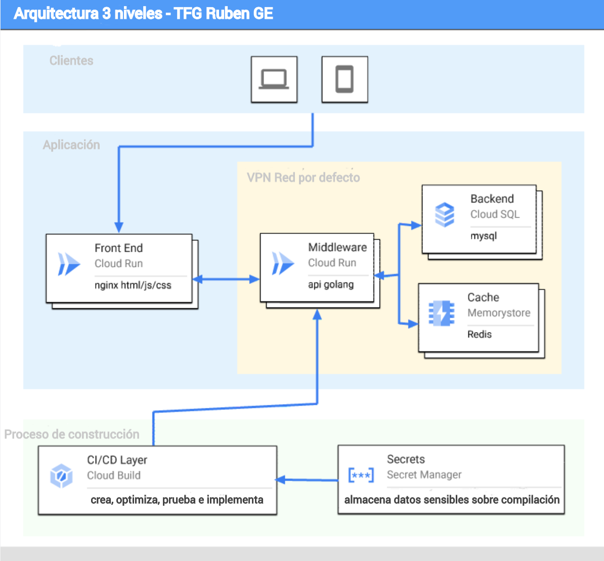

# Three Tier App (TFG Ruben) 

Esta es una simple aplicación escrita en contenedores que utiliza un backend MySQL junto con Redis Caching para impulsar una API y un frontend que alimenta una pequeña y simple aplicación. También pone en marcha la infraestructura de Google Cloud para alimentar la aplicación.

## Cleanup 
Para eliminar todos los componentes de facturación del proyecto
1. Escribir `deploystack uninstall`

## Development
He implementado una configuración de desarrollo para esta aplicación que utiliza Docker para ejecutar 
todo lo necesario para desarrollar y poder probarlo localmente. 

Para ejecutarlo:
1. Abrir un terminal en mi repositorio local. 
1. `cd code`
1. `make dev`

Esto hará funcionar 4 contenedores
1. MySQL /database
1. Redis
1. Golang API /middleware
1. Static HTML/JS/CSS site /frontend